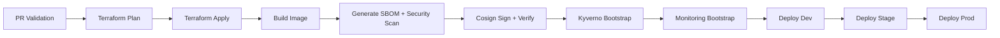

# Senior DevOps Interview Guide: AKS CI/CD Workflow

## 1) Executive Summary (How to pitch this in 30 seconds)
This project implements a production-style AKS delivery platform with security and reliability controls across the software supply chain. It provisions cloud infrastructure with Terraform, builds and signs immutable container images, enforces admission policies in-cluster, promotes the same signed artifact through dev/stage/prod, and includes observability and drift detection.

Key design principle: shift trust and validation left, then enforce again at runtime.

## 2) End-to-End Workflow Steps

### 2.1 PR Validation
- Runs format/validate/plan for Terraform.
- Runs policy checks (Conftest/Rego) on Kubernetes manifests.
- Runs security scans (tfsec + Trivy filesystem) and uploads SARIF.
- Enforces pinned GitHub Actions.

### 2.2 Infrastructure Provisioning
- Terraform creates/updates Azure resources (AKS, ACR, RG, RBAC).
- Remote state uses Azure Blob backend with locking via blob leases.

### 2.3 Build Once, Promote Many
- Docker image is built once in CI.
- CI captures immutable image digest reference (registry/repo@sha256:...).
- Same digest is promoted across environments (no rebuild per environment).

### 2.4 Supply Chain Controls
- CI signs the digest with Cosign keyless signing (GitHub OIDC identity).
- CI verifies signature before deployment.
- Kyverno policy in AKS admits only images signed by expected workflow identity.

### 2.5 Runtime Deployment Controls
- Digest pinning is enforced before manifest apply.
- Rollout strategy and health checks gate success/failure.
- Automatic rollback triggers on rollout or smoke-test failures.

### 2.6 Observability
- kube-prometheus-stack deployed by workflow.
- ServiceMonitor scrapes app metrics endpoint (/metrics).
- Grafana dashboards consume Prometheus time-series.

## 3) Security and Reliability Concepts (Interview-Ready)

### Image Signing
What it is:
- Cryptographic proof that a trusted identity approved a specific artifact.

Why it matters:
- Prevents untrusted image deployment.
- Detects tampering because changed content changes digest and invalidates signature trust chain.

How implemented here:
- Cosign keyless signing in CI.
- Identity bound to GitHub workflow OIDC subject.
- Kyverno verifyImages policy enforces signer identity at admission.

### Image Digest Pinning
What it is:
- Deploying by immutable digest instead of mutable tag.

What a digest is:
- A content-addressed fingerprint of the image bytes, usually shown as sha256:<hash>.
- If the image content changes, the digest changes.
- This is why digest references are immutable identifiers for "exactly this artifact."

Why it matters:
- Prevents tag drift and "works in test, different image in prod" scenarios.

How implemented here:
- Pipeline refuses deployment unless image format is @sha256:<64-hex>.

### Supply Chain Hardening
What it includes here:
- Action SHA pinning (prevents action supply chain substitution).
- Monthly SHA rotation workflow.
- Trivy and tfsec vulnerability gates.
- SBOM generation and artifact retention.
- Policy-as-code checks in PR.

### SBOM (Software Bill of Materials)
What it is:
- A machine-readable inventory of components included in a software artifact.
- Typical contents include packages, versions, and dependency graph data.

Why it matters:
- Improves vulnerability triage and incident response.
- Helps answer "where is this vulnerable package deployed?"
- Supports compliance and provenance discussions with auditors.

How implemented here:
- CI generates SBOM for the exact digest-pinned image and uploads it as an artifact.

### SARIF (Static Analysis Results Interchange Format)
What it is:
- A standardized JSON schema for security/static-analysis findings.
- Enables scanners to publish results in a common format.

Why it matters:
- Centralized visibility of findings in GitHub Security.
- Consistent severity reporting and developer workflow integration.

How implemented here:
- Trivy and tfsec outputs are uploaded as SARIF so findings appear in repository security views.

### Policy as Code and Admission Control
What it is:
- Declarative rules to enforce baseline security and operability.

How implemented here:
- Conftest/Rego validates manifests before merge.
- Kyverno enforces runtime signature policy in-cluster.

### State Locking in Terraform
What it is:
- Prevents concurrent state writes.

How implemented here:
- Azure Blob backend locking through leases.
- Avoids state corruption from parallel apply operations.

### Zero/Low Downtime Rollouts
What it is:
- Controlled replacement of pods without service interruption.

How implemented here:
- RollingUpdate with maxUnavailable=0 and maxSurge=1.
- PodDisruptionBudget for voluntary disruption protection.
- Readiness/liveness probes and rollback.

## 4) Real Issues Encountered and How They Were Solved

### Issue A: Admission Deny (no signatures found)
Symptom:
- Kyverno denied deployment despite CI signing.

Root causes addressed:
- Registry credential visibility for signature lookup.
- Admission-side access to private ACR.

Solution:
- Provisioned registry credentials for the required namespaces and validated policy path with a negative canary.

### Issue B: Monitoring Bootstrap Action Pin Failure
Symptom:
- Workflow failed resolving azure/setup-helm pinned SHA.

Root cause:
- Invalid commit SHA for the referenced tag.

Solution:
- Updated to valid SHA.
- Hardened SHA updater to resolve peeled tag commit (annotated/lightweight tag compatibility).

### Issue C: ServiceMonitor Did Not Discover App Target
Symptom:
- Prometheus targets showed stack internals only; app target missing.

Root cause:
- ServiceMonitor selector expected app label on Service metadata, but Service lacked it.

Solution:
- Added metadata label app: click-counter to Service.
- Re-applied Service + ServiceMonitor.

### Issue D: Counter Appeared to Reset/Inconsistent
Symptom:
- UI count jumped/reset when clicking.

Root cause:
- In-memory counter with multiple replicas (state not shared).

Solution/Explanation:
- Expected behavior for stateless multi-pod app.
- For consistent global counter, move state to external store (Redis/DB).

## 5) Why This Is Senior-Level
- Defense in depth: PR checks + CI verification + runtime admission enforcement.
- Artifact immutability and provenance controls.
- Clear separation of reusable workflows (deploy, policy bootstrap, monitoring bootstrap).
- Operational safeguards: rollback, drift detection, action pinning governance.
- Observability baseline and troubleshooting runbooks.

## 6) Trade-offs You Should Acknowledge in Interview
- Self-managed Prometheus/Grafana gives control but adds operational overhead; managed Azure alternatives reduce toil.
- In-memory demo app state is acceptable for sample apps but not for globally consistent business counters.
- Strict policies increase safety but require disciplined change management and exceptions process.

## 7) Suggested Interview Talk Track (2-3 minutes)
1. Start with architecture: Terraform provisions AKS/ACR, CI builds once and promotes by digest.
2. Explain trust chain: signed artifact, verified in CI, enforced by Kyverno in cluster.
3. Explain reliability: rolling strategy, PDB, health checks, rollback.
4. Explain governance: policy-as-code, action pinning, drift detection, SARIF visibility.
5. Close with lessons learned from incidents and why those fixes improved systemic resilience.

## 8) Files to Reference During Interview
- .github/workflows/deploy.yml
- .github/workflows/deploy-environment.yml
- .github/workflows/kyverno-bootstrap.yml
- .github/workflows/monitoring-bootstrap.yml
- .github/workflows/pr-validation.yml
- .github/workflows/terraform-drift-detection.yml
- k8s/policies/kyverno-verify-main-signer.yaml
- policy/kubernetes/deployment.rego
- k8s/deployment.yaml
- k8s/pdb.yaml
- docs/observability-runbook.md

## 9) Quick Glossary (Term -> Meaning -> Where Used)

| Term | Meaning (1-liner) | Where Used in This Project |
| --- | --- | --- |
| Image Digest | Immutable hash of image content (sha256:...). | Build output promoted across envs; deploy gates require digest references. |
| Image Tag | Mutable alias to an image version. | Used during build push; not trusted for deployment decisions. |
| Digest Pinning | Deploying by digest instead of tag. | Deployment workflow blocks non-digest image references. |
| Image Signing | Cryptographic proof that a trusted identity approved an artifact. | Cosign sign/verify in CI; enforced by Kyverno at admission. |
| OIDC | Federated identity flow to get short-lived cloud tokens. | GitHub Actions authenticates to Azure and keyless signing identity. |
| Supply Chain Hardening | Controls that protect build, dependency, and artifact trust. | Action SHA pinning, scanners, SBOM, policy checks, signature enforcement. |
| SBOM | Inventory of software components and dependency metadata. | Generated for the image and uploaded as an artifact. |
| SARIF | Standard format for static/security findings. | Trivy/tfsec findings uploaded to GitHub Security views. |
| SAST/Scanning Gates | Security checks that can fail CI before merge/deploy. | tfsec, Trivy fs/image scans, Conftest policy checks. |
| Policy as Code | Rules expressed as code for repeatable enforcement. | Rego policies in PR checks; Kyverno policy in cluster. |
| Kyverno Admission Policy | Cluster policy engine for Kubernetes resources. | Verifies signer identity and blocks untrusted images. |
| Conftest/Rego | Pre-merge policy validation against manifests. | Validates security, rollout, and manifest quality controls. |
| RollingUpdate | Deployment strategy replacing pods gradually. | maxUnavailable=0 and maxSurge=1 for safer rollouts. |
| PodDisruptionBudget (PDB) | Guardrail limiting voluntary pod evictions. | Keeps minimum app availability during maintenance events. |
| Readiness Probe | Signal that a pod is ready to receive traffic. | Used to prevent traffic to unhealthy/new pods. |
| Liveness Probe | Signal that process is healthy and should continue running. | Used for restart decisions when app becomes unhealthy. |
| State Locking | Prevents concurrent Terraform state writes. | Azure Blob backend lease mechanism in remote state. |
| Drift Detection | Detecting infra changes made outside Terraform. | Nightly/manual workflow fails on actionable drift. |
| Idempotency | Repeated apply reaches same desired state safely. | Terraform apply and kubectl apply in reruns. |
| Canary/Negative Test | Purposeful failing test to verify controls catch bad inputs. | Dev Kyverno negative canary confirms admission deny path. |
